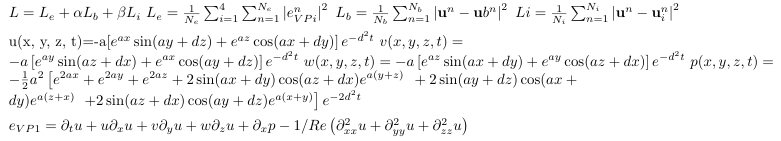
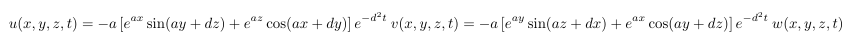

# NSFnets
PINN in solving Navier–Stokes equation
## tiny differences between those four NSFnets

VP_NSFnets1.py is the code to simulate Kovasznay flow(2 dimension without time)  
VP_NSFnets2.py is the code to simulate cylinder wake(2 dimension with time)  
VP_NSFnets3.py is the code to simulate Beltrami flow(3 dimension with time)  
VP_NSFnets4.py is the code to simulate Turbulent channel flow(3 dimension with time)  

## loss function defined in the NSFnets

## analytic solution for case 3 Beltrami flow

